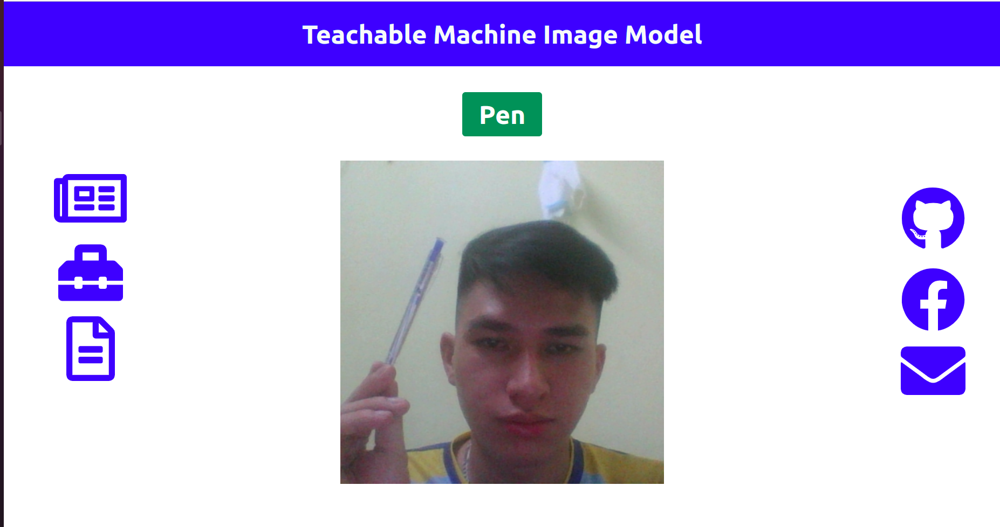

# Subject: Identification Engineering
Latest update: May 8, 2021
## Introduce
The system used for *image recognition* based on [***Google's Teachable Machine***](https://teachablemachine.withgoogle.com/) module
## Feature
Use webcam to identify objects such as:
- pens
- calculators
- while other objects will result *"Unknow"*
## Guide
1. Click **START** button
2. Wait a moment for the system to boot
3. Put the objects in front of your webcam one by one the system will tell you what it is

## Preview

